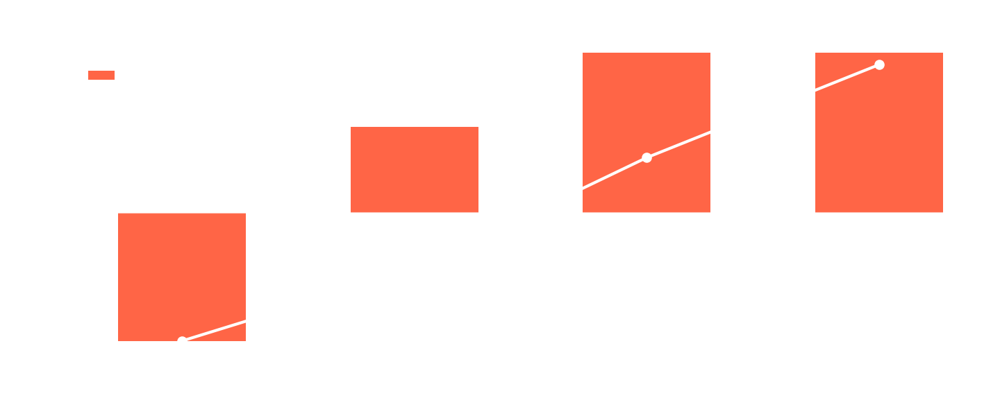

<!--
ПРИМЕР ЗАПОЛНЕННОЙ ЗАЩИТЫ. Учебный вымышленный кейс: организация, объект
и все цифры придуманы. Показывает формат, а не реальную аналитику.

Структура — девять слайдов: шесть типовых слайдов питча инициативы курса DDDM
(титул → видение → гипотезы и риски → фазы → ресурсы → инвестиционные
показатели) + два слайда специфики программы (решение и роль ИИ, допустимость)
+ отдельный слайд «График NPV».

Обратите внимание на четыре вещи:
  1. Каждая цифра сопровождается меткой достоверности.
  2. В расчёт заложена консервативная (минимальная) граница коридора.
  3. Каждая цифра прослеживается до ячейки Excel-модели (finmodel.xlsx).
  4. Последний слайд заканчивается действием и ответственным, а не «спасибо за внимание».

График для слайда 9 собирается финмоделью:
  python3 finmodel.py --chart-npv npv_payback_example.png
-->

<!-- _class: title -->

### Проектная инициатива · этап: концепция

# Предпроектная проработка инициатив регионов

Иван Петров · директор департамента инфраструктурных проектов
Мини-группа: Петров, Соколова, Дёмин, Гаврилова

<!-- Реплика (20 сек): Добрый день. Представляю проектную инициативу:
сервис предпроектной проработки для регионов. Это этап концепции —
защищаю гипотезу, а не отчёт о внедрении. -->

---

## Видение

# Для регионов, которым нужна концепция объекта, сервис готовит черновик за три дня вместо десяти недель

**В отличие от** ручного цикла с очередью к аналитикам — черновик делает агент,
эксперт департамента проверяет и подписывает.

**Почему сейчас:** запрос регионов вырос, экспертный ресурс ограничен.

<!-- Реплика (30 сек): Формула простая: для регионов, которым нужна концепция
объекта, наш сервис даёт черновик за три дня. Отличие от сегодняшнего пути —
не больше людей в очередь, а агент, который делает черновую работу. -->

---

## Решение и роль ИИ

**Что появится:** сервис, который по обращению региона собирает черновик концепции —
профиль территории, сопоставимые объекты, диапазон стоимостных параметров, структура
обоснования — и передаёт его эксперту департамента на доработку.

**Класс решения:** агент с интеграциями

*Почему именно этот класс:* базы знаний недостаточно — нужны обращения к внешним
реестрам и расчёт; автономный агент избыточен — заключение подписывает эксперт.

| Сегодня | После |
|---|---|
| ручной сбор данных, очередь заявок — **L1** | сбор и черновик агентом, эксперт проверяет — **L3** |

<!-- Реплика (30 сек): Минимальный класс, который закрывает задачу, — агент
с интеграциями. Автономию мы сюда не ставим: ответственность за заключение
остаётся на эксперте, и это принципиально. -->

---

## Гипотеза, эффект и риски

**Гипотеза с числом:** агент сокращает трудозатраты аналитика с 60 до ≤34 часов
на заявку уже на пилоте из 20 заявок ГИПОТЕЗА

| Эффект | Ед. изм. | Минимум | Типично | Максимум | Достоверность |
|---|---|---|---|---|---|
| Срок подготовки концепции | недель | 10 → 4 | 10 → 3 | 10 → 2 | АНАЛОГ |
| Трудозатраты аналитика на заявку | часов | 60 → 34 | 60 → 28 | 60 → 24 | БЕНЧМАРК |

**Опережающая метрика:** доля заявок с черновиком в первые 3 дня ≥ 70 % ·
**Запаздывающая:** число доведённых до соглашения проектов за год

**Главный риск:** стоимостные оценки агента расходятся с аналогами → порог остановки
30 % и разбор экспертом, оценка не уходит региону без подписи.

> В расчёт заложена **консервативная граница**: 34 часа и текущие 240 заявок.

<!-- Реплика (35 сек): Гипотеза проверяемая: часы на заявку, порог 34, пилот
из 20 заявок. Эффект — коридором с метками, считаем по нижней границе. Риск
называем сами и показываем, как он закрыт порогом остановки. -->

---

## Допустимость

| Параметр | Решение |
|---|---|
| Класс данных | служебная тайна (материалы заявок регионов) |
| Контур размещения | аттестованный закрытый контур организации |
| Участие человека | обязательно: заключение подписывает эксперт департамента |
| Порог отзыва полномочий | расхождение стоимостной оценки с аналогами более 30 % → останов, разбор экспертом |
| Ответственный за ошибочное решение | руководитель профильного управления |

*К проверке юристом:* режим служебной тайны при передаче материалов в контур ·
маркировка сгенерированных разделов концепции с 01.09.2026

<!-- Реплика (30 сек): Заявки регионов — служебная тайна, поэтому облако
исключено: только аттестованный контур. Подпись эксперта остаётся обязательной. -->

---

## Ключевые фазы

| Фаза | Результат (работающий, не отчёт) | Срок | Точка решения |
|---|---|---|---|
| Пилот: 20 заявок одного типа | черновики концепций в контуре, замер часов | кв. 1 | ≤ 34 ч/заявка — продолжаем |
| Подключение реестров | агент сам собирает профиль территории | кв. 2 | доля черновиков за 3 дня ≥ 70 % |
| Раскатка на все типы заявок | сервис в регулярном процессе департамента | кв. 3–4 | окупаемость идёт по базовому сценарию |

**Первая фаза — пилот** с тем же числовым критерием «сработало / не сработало», что и в холсте.

<!-- Реплика (25 сек): Каждая фаза заканчивается работающим результатом.
После каждой — точка решения: продолжаем, меняем подход или останавливаемся.
Порог пилота — 34 часа на заявку. -->

---

## Ресурсы

| Роль | Загрузка | Откуда |
|---|---|---|
| Владелец инициативы (директор департамента) | 10 % | внутри |
| Эксперт-аналитик предпроектной проработки | 50 % на пилоте | внутри |
| Команда внедрения (интеграции, контур) | по договору | подрядчик |
| Специалист по данным реестров | 20 % | внутри |

**Трудозатраты подрядчика:** 90–140 dev days ГИПОТЕЗА ·
**Закупки:** лицензии модели в контуре, мощности аттестованного контура

**Срок с момента старта:** пилот — 8 недель, первое решение по результатам — 12 недель

<!-- Реплика (25 сек): Команда ролями: эксперт наполовину занят пилотом,
интеграции делает подрядчик. Оценка трудозатрат — диапазоном, это гипотеза
до обследования. -->

---

## Инвестиционные показатели

<b>+13,9 млн ₽</b>NPV за 3 года

<b>15 мес</b>окупаемость

<b>99 %</b>вероятность NPV > 0

| Сценарий | NPV, млн ₽ | Окупаемость |
|---|---|---|
| Консервативный (стресс) | −11,3 | не окупается |
| Базовый | +13,9 | 15 мес |
| Оптимистичный | +58,7 | 5 мес |

**Бюджет:** внедрение 12,0 млн ₽ · сопровождение 2,4 млн ₽/год · ставка 20 % ГИПОТЕЗА

Не окупается, если трудозатраты не опустятся ниже **46 ч** ·
каждая цифра — из **finmodel.xlsx** (модель живыми формулами)

<!-- Реплика (30 сек): Базовый сценарий окупается за 15 месяцев. Стресс-сценарий
честно не окупается; вероятность такого исхода по пяти тысячам прогонов — около
процента. Модель открыта: любую ячейку можно проследить до констант. -->

---

## График NPV

**Первый шаг:** до понедельника — встреча с владельцем реестра заявок, получить ответ,
доступна ли выгрузка за 2024–2026 гг. · **Знает об этом:** руководитель управления

<!-- Реплика (25 сек): Столбики — денежный поток по годам, линия — накопленный
дисконтированный поток. Где линия пересекает ноль — там окупаемость, у нас это
пятнадцатый месяц. Первый шаг — не «проработать вопрос», а получить конкретный
ответ до понедельника. Прошу поддержать пилот. Спасибо. -->
